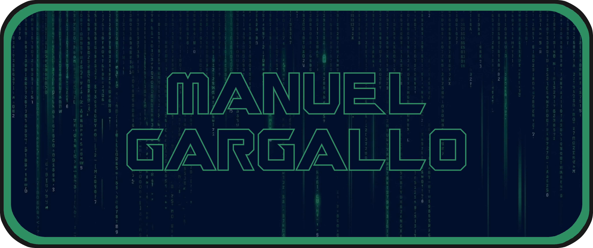

    
    
    
    

---

# H E L L O &nbsp;&nbsp; W O R L D ! 

I'm Manuel. I'm a Software Engineer and Production Engineer who loves automation, building efficient internal tools, and optimizing large-scale infrastructure. My work bridges the gap between clean code and rock-solid system reliability.

Currently, I spend my time engineering feature-rich tools for infrastructure and power management at scale, but here on GitHub, you'll find my open-source projects, automation scripts, and technical experiments.

---

## WHAT I DO

- **Systems & Infrastructure:** Specializing in large-scale server power management, system-wide configuration changes, and incident reliability.
- **Automation & Devops:** Streamlining CI/CD pipelines, reducing deployment errors, and writing robust scripts to eliminate manual overhead.
- **Data & Scripting:** Processing complex data and building internal utilities, a foundation built during my background in Aerospace Engineering.

---

## TECH STACK

- **Languages:** Python | C++
- **Focus Areas:** Scripting & Automation | CI/CD Pipelines | Infrastructure at Scale | Incident Management

---

## COLABORATIONS

### [omarchy-on-cachyos](https://github.com/ManuelGargallo/omarchy-on-cachyos)
*One of my latest projects: An automated compatibility and installation script to deploy DHH's opinionated Omarchy desktop environment directly on top of a performance-optimized CachyOS system.*
- Developed using **Shell Scripting**.
- Solves environment configuration conflicts and package mismatches (such as AUR helpers, shells, and display managers) by automating the integration line-by-line to ensure a stable, unified deployment.

---

### **Feel free to explore my repositories, open an issue, or connect with me.**

---

    

